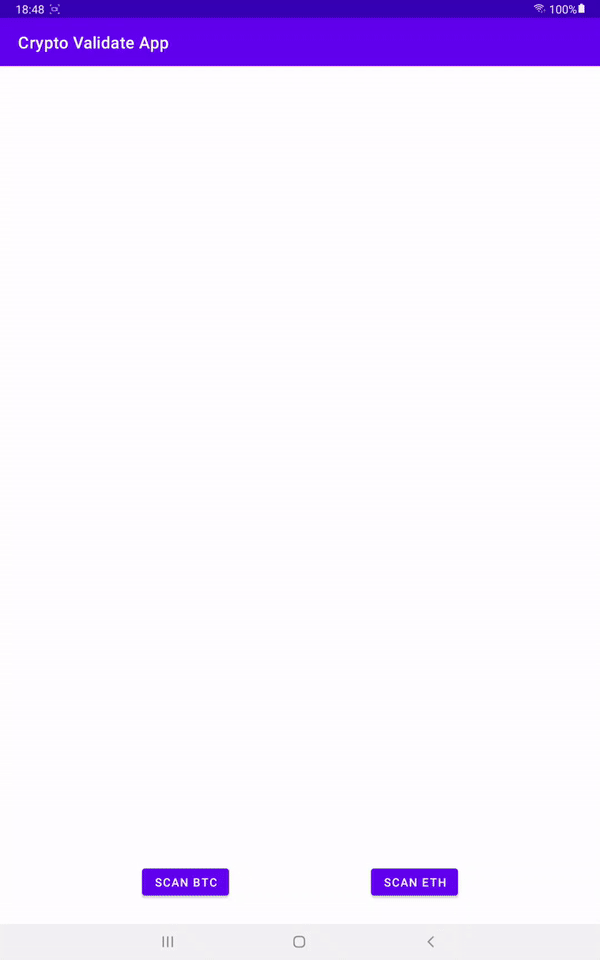

# Crypto Validate App

Android app to validate BTC/ETH coin address by scanning their QR Codes.
App is a Single Activity Application developed using Kotlin and XML based on MVVM architecture.

## APK
- [APK Link](https://drive.google.com/drive/folders/1BNu8NjZzeTriY0QbtrPwrSzaP4CN4BYQ?usp=sharing)

## Demo

## Libraries
- `Jetpack` : LiveData, ViewModel, ViewBinding
- `QR Code Scanner` : Library to scan QR code [Gtihub Link](https://github.com/yuriy-budiyev/code-scanner)
- `Navigation Component` : Navigate across various fragments
- `Timber` : For logginh purpose

